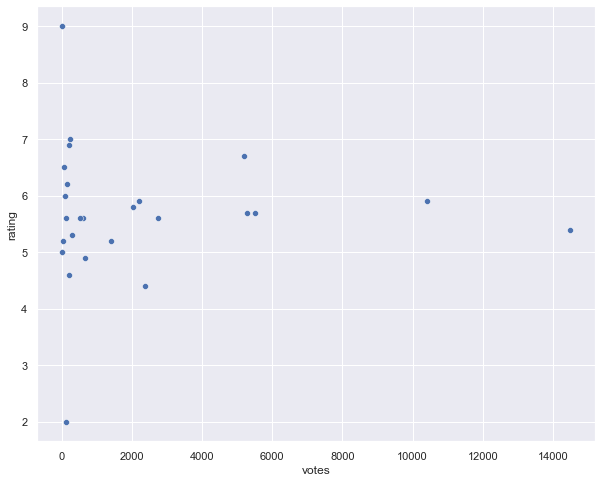
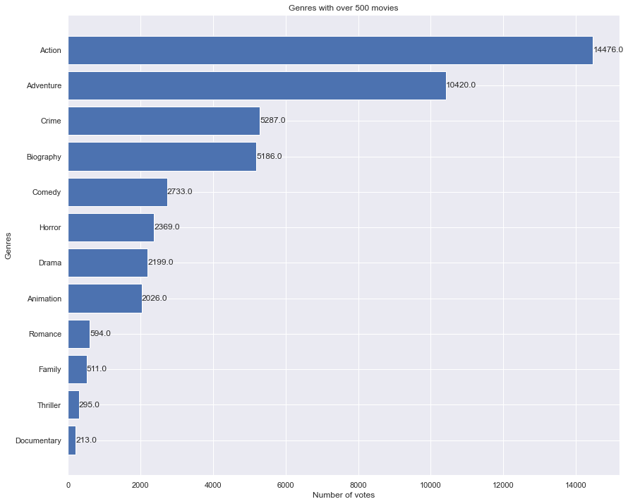
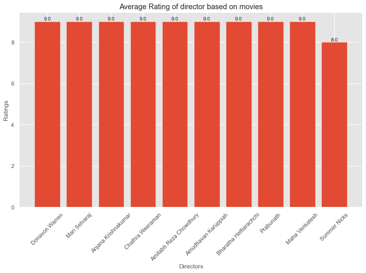
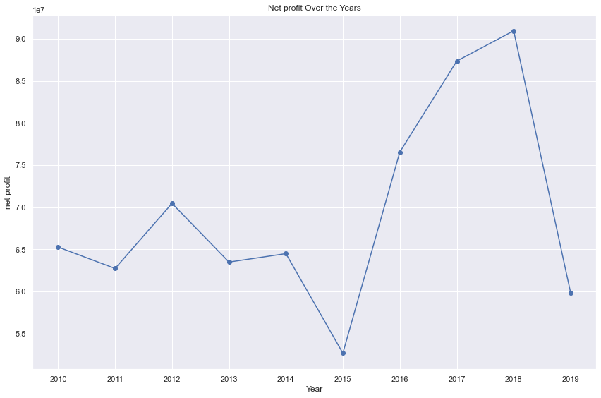

# Studio_Afrik

## Overview

With the increasing trend of big studios creating original video content, Studio-Afrik has decided to establish a new movie studio. However, we currently lack expertise in movie production. To ensure our new venture's success, it is crucial to to carry out data analysis from historical data. We can derive actionable insights to guide the head of Studio-Afrik in making informed decisions about the types of films to produce.

## Business Understanding

Studio-Afrik aims to enter the movie production industry by establishing its new movie studio. The primary goal is to create original video content that resonates with audiences and performs well at the box office, leveraging the current trend among big companies.

To ensure the success in this new indurstry, it is crucial to understand the types of films that are currently performing best. This involves analyzing market trends, audience preferences, and the financial performance of various genres and film types.

## Data Understanding and Analysis

The datasets used are:

I. **Relational Database**

1. im.db

II. **CSV FILES**

2. tn.movie_budgets.csv

### Insights

This project uses descriptive analysis to attempt to understand major success indicators in the movie industry and identify potentially useful strategies for producing a successful business

**Genre ratings Based on number of votes**

As a start-up, genres with high rating should not be picked for production without considering the number of votes that participated inthe rating.

It is also good to consider top genres that has a high number of movies filmed.

**Top 10 Directors to hire**

**Investment Returns Based on Production Budgets**

**Net profit produced per year**

## Conclusion

#### Genre

Studio-Afrik should consider picking top rated genres with highest number of votes. Our analysis indicates a genre can have a high average rating due to low votes. Therefore, they should venture into Action, Adventure, Crime, Biography, comedy which are the top five rated genres considering they have high number of votes.

#### Directors to higher

Studio-Afrik should focus on attracting renowned and respected directors to elevate film quality and enhance audience ratings, which will ultimately generate greater revenue and create lasting impact in the film industry. 

The top ten directors with average movie rating based on votes above mean of votes are: 'Donavon Warren', 'Mari Selvaraj', 'Anjana Krishnakumar',
'Chathra Weeraman', 'Amitabh Reza Chowdhury', 'Amudhavan Karuppiah','Bharatha Hettiarachchi', 'Prabunath', 'Maha Venkatesh' and 'Summer Nicks'

#### Invest in production budget

From our analysis above, we observe that investmenting in production budget has a positive return on the net profit. Our data shows a positive linear relationship between production budget and net profit.

Movie indurstry has recorded positive net profits in every year in our dataset.